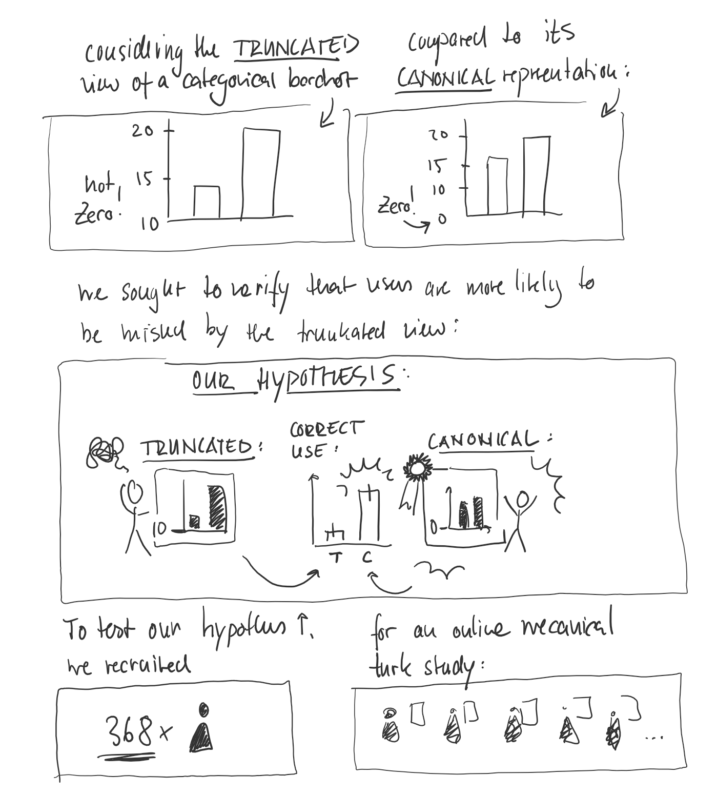
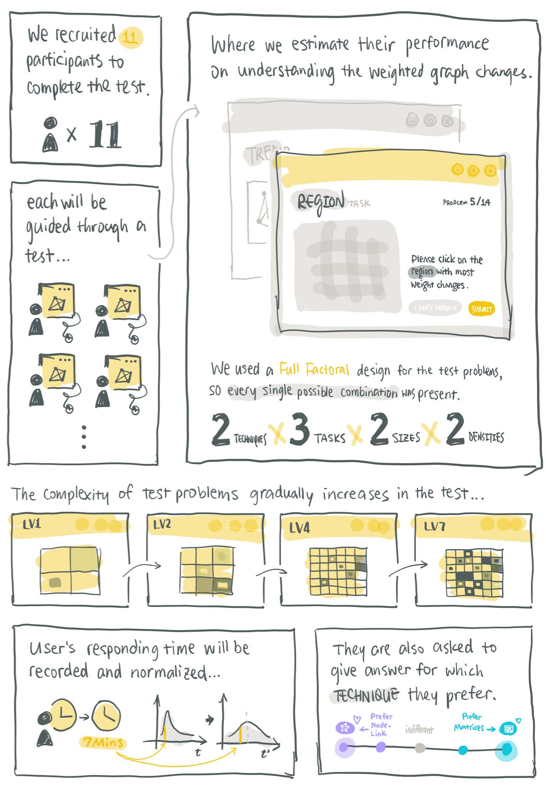

  

    

      
    

    

      

        <h2>A Lie Reveals the Truth</h2>
        
By Benjamin Bach

      

      

        <a href class="exhib-button">
          <i class="material-icons">menu_book</i>
          <small>Paper</small>
        </a>
        <a href class="exhib-button">
          <i class="material-icons">crop_original</i>
          <small>Comics</small>
        </a>
      

    

  

  
  

    

      
    

    

      

        <h2>Weighted Graph Comparison Techniques for Brain Connectivity Analysis</h2>
        
By John Doe

      

      

        <a href class="exhib-button">
          <h1>P</h1>
          <small>Paper</small>
        </a>
        <a href class="exhib-button">
          <h1>C</h1>
          <small>Comics</small>
        </a>
      

    

  

    

      
    

    

      

        <h2>Whatever Other Things We've Got HHere</h2>
        
By John Doe

      

      

        <a href class="exhib-button">
          <h1>P</h1>
          <small>Paper</small>
        </a>
        <a href class="exhib-button">
          <h1>C</h1>
          <small>Comics</small>
        </a>
      

    

  

