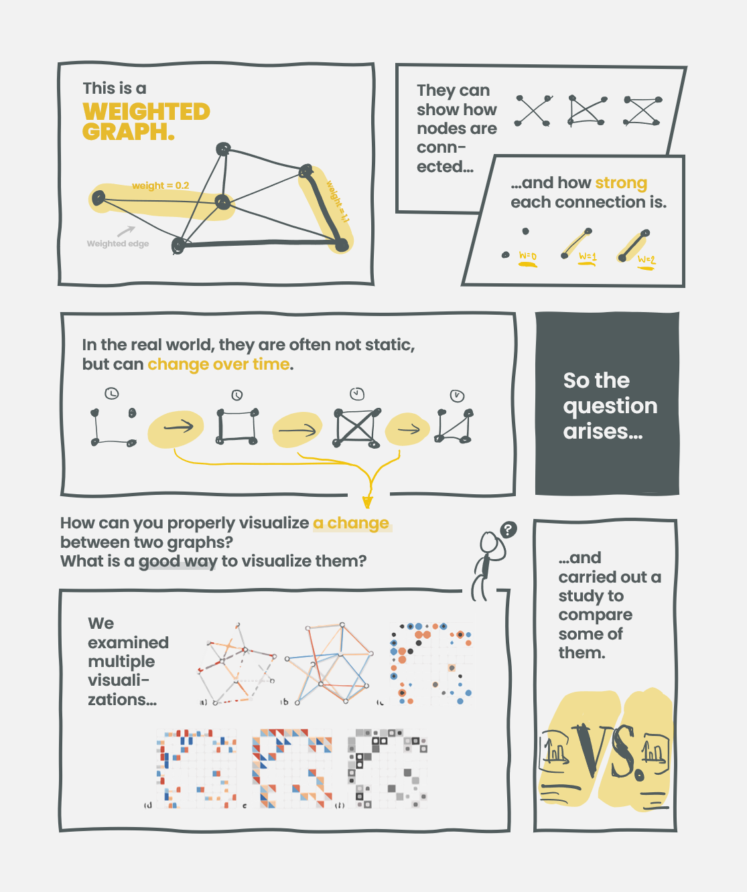
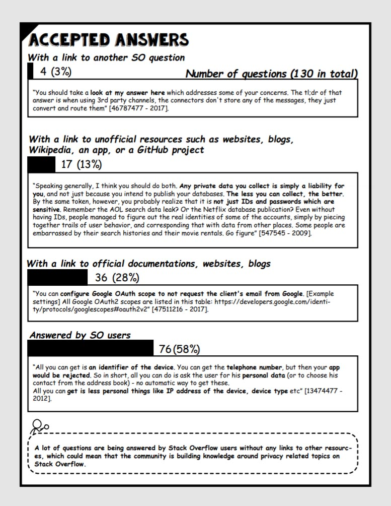
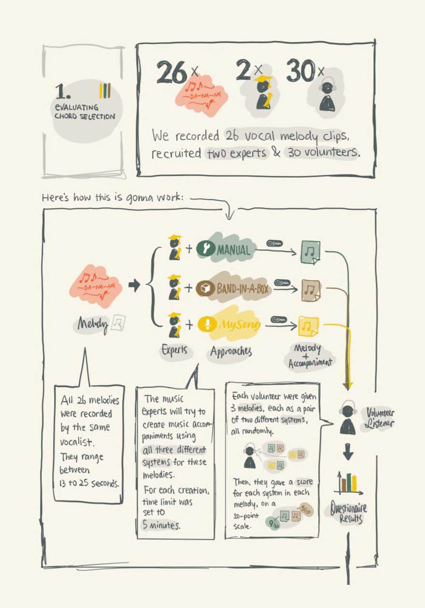

  

    

      
    

    

      

        <h2>
          Weighted Graph Comparison Techniques for Brain Connectivity Analysis
        </h2>
        
By Jingtao Zhou

      

      

        <a
          href="https://hal.inria.fr/hal-00780999/document"
          class="exhib-button"
        >
          <i class="material-icons">menu_book</i>
          <small>Paper</small>
        </a>
        <a href="/gallery/weighted.html" class="exhib-button">
          <i class="material-icons">crop_original</i>
          <small>Comic</small>
        </a>
      

    

  

  
  

    

      
    

    

      

        <h2>
          Understanding Privacy-Related Questions on Stack Overflow
        </h2>
        
By Zezhong Wang

      

      

        <a
          href="https://www.wiki.ed.ac.uk/display/TRG/Developer-Centred+Security+and+Privacy"
          class="exhib-button"
        >
          <i class="material-icons">menu_book</i>
          <small>Paper</small>
        </a>
        <a href="/gallery/privacy.html" class="exhib-button">
          <i class="material-icons">crop_original</i>
          <small>Comic</small>
        </a>
      

    

  

  

    

      
    

    

      

        <h2>A Lie Reveals the Truth</h2>
        
By Benjamin Bach

      

      

        <a
          href="https://www.jacobritchie.xyz/a_lie_reveals_the_truth.pdf"
          target="blank"
          class="exhib-button"
        >
          <i class="material-icons">menu_book</i>
          <small>Paper</small>
        </a>
        <a href="/gallery/lie.html" class="exhib-button">
          <i class="material-icons">crop_original</i>
          <small>Comic</small>
        </a>
      

    

  

  

    

      
    

    

      

        <h2>
          MySong: Automatic Accompaniment Generation for Vocal Melodies
        </h2>
        
By Jingtao Zhou

      

      

        <a
          href="https://dl.acm.org/doi/10.1145/1357054.1357169"
          class="exhib-button"
        >
          <i class="material-icons">menu_book</i>
          <small>Paper</small>
        </a>
        <a href="/gallery/mysong.html" class="exhib-button">
          <i class="material-icons">crop_original</i>
          <small>Comic</small>
        </a>
      

    

  

  

    

      
    

    

      

        <h2>
          Animation Study
        </h2>
        
By Fanny Chevalier

      

      

        <a
          class="exhib-button" style="width: 120px"
        >
          <i class="material-icons">event</i>
          <small>To be released</small>
        </a>
      

    

  

