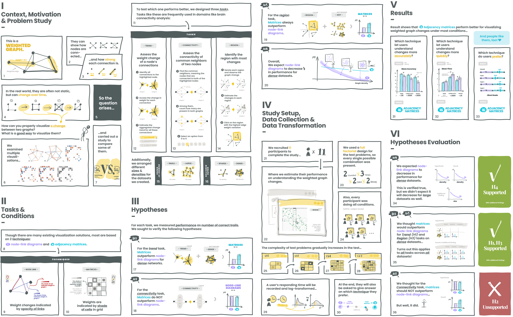

***[Data Comics for Reporting Controlled User Studies in Human-Computer Interaction](wang2020stats.pdf)***:
Zezhong Wang, Jacob Ritchie, Jingtao Zhou, Fanny Chevalier, Benjamin Bach
*IEEE Transactions on Visualization and Computer Graphics (TVCG) 2021 (IEEE VIS, 2020))* 
